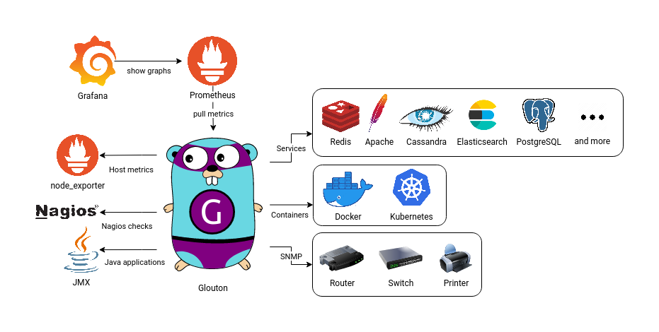
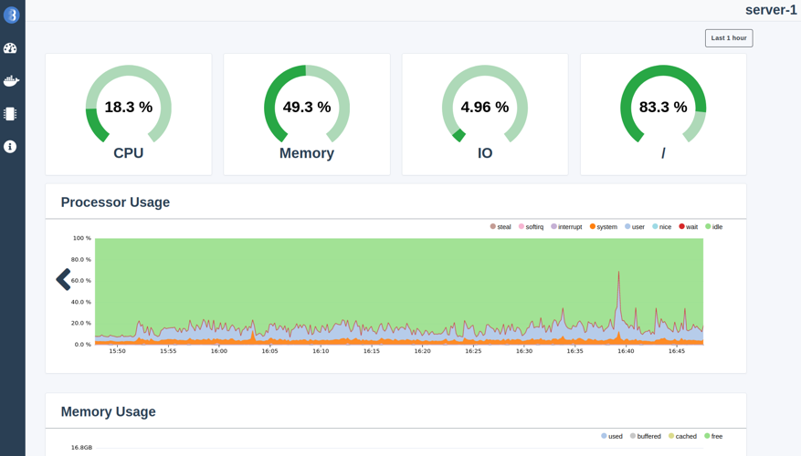

<p align="center">
   
</p>

[](https://goreportcard.com/report/github.com/bleemeo/glouton)
[](https://github.com/bleemeo/glouton/blob/master/LICENSE)

[](https://hub.docker.com/r/bleemeo/glouton/tags)
[](https://hub.docker.com/r/bleemeo/glouton)

**Glouton** is a monitoring agent that makes observing your infrastructure easy. Glouton retrieves metrics from **node_exporter** and multiple **telegraf inputs** and expose them through a **Prometheus endpoint** and a **dashboard**. It also automatically discovers your [services](#automatically-discovered-services) to retrieve relevant metrics.

Glouton is the agent used in the **Bleemeo cloud monitoring solution**. Deploying a **robust, scalable monitoring solution** can be time consuming. At Bleemeo, we focus on making users life **easier**. Check out the solution we offer on our [website](https://bleemeo.com) and try it now for free!

<p align="center">
   
</p>

## Features

- [**Automatic discovery and configuration of services**](#automatically-discovered-services) to generate checks and metrics
- Can be used as the main **[Prometheus endpoint](#metrics-endpoint)** for another scrapper
- Support **[Nagios checks](https://docs.bleemeo.com/metrics-sources/custom/#reference-for-custom-check), [NRPE](https://docs.bleemeo.com/agent/configuration/#nrpeaddress) and [StatsD](https://docs.bleemeo.com/metrics-sources/statsd)** metrics ingester
- **Kubernetes native:** create metrics and checks for pods
- Monitor your printers and network devices with [**SNMP**](https://docs.bleemeo.com/agent/snmp)
- **[JMX support](https://docs.bleemeo.com/metrics-sources/java)** to monitor your Java applications.
- Integrated **web dashboard**
- Support [pushing metrics](#mqtt) to an external **[MQTT](https://mqtt.org/) broker**

<p align="center">
   
</p>

### Automatically discovered services

Glouton automatically detects and generates metrics for your services. Supported services include **Apache**, **Cassandra**, **Redis**, **Elasticsearch**, **Nginx**, **PostgreSQL**, and many others. The full list of services and generated metrics can be found [here](https://docs.bleemeo.com/metrics-sources/services-metrics).

### Metrics endpoint

A metrics endpoint is available on port http://localhost:8015/metrics by default (this can be configured [here](https://docs.bleemeo.com/agent/configuration#weblisteneraddress)). This endpoint can be scrapped by Prometheus for example to retrieve the metrics and show them in Grafana.

A docker compose file is available to quickly setup a full monitoring stack. It includes Grafana, Glouton and a Prometheus configured to scrap Glouton's metrics endpoint.

```sh
# For Linux
(cd examples/prometheus; docker-compose up -d)
# For MacOS
(cd examples/prometheus_mac; docker-compose up -d)
```

Then go to the Grafana dashboard at http://localhost:3000/d/83ceCuenk/, and log 
in with the user "admin" and the password "password".

### Push metrics to MQTT

Glouton can periodically push metrics to an external MQTT broker.

A docker compose file is available to show a working monitoring setup with a Glouton pushing points
to MQTT. [SquirrelDB Ingestor](#TODO) is used to receive the metrics from MQTT and to write them to 
[SquirrelDB](https://github.com/bleemeo/squirreldb), a scalable timeseries database. This setup 
uses [NATS](https://nats.io/) as the broker, any other broker will work but we prefer NATS for its scalability.  

```sh
(cd examples/mqtt; docker-compose up -d)
```

More details are available on [SquirrelDB Ingestor](#TODO) on how to use authenticated MQTT
connections and how this setup can be scaled for high availability.

## Install

Glouton can be installed with Docker, Kubernetes, on Windows or as a native Linux package.
If you use Glouton with the Bleemeo solution, you should follow the [documentation](https://docs.bleemeo.com/agent/installation/).

### Docker

A docker image is provided to install Glouton easily.

```sh
docker run -d --name="bleemeo-agent" \
    -v /var/lib/glouton:/var/lib/glouton -v /var/run/docker.sock:/var/run/docker.sock -v /:/hostroot:ro \
    -e  GLOUTON_BLEEMEO_ENABLE='false' --pid=host --net=host \
    --cap-add SYS_PTRACE --cap-add SYS_ADMIN bleemeo/bleemeo-agent
```

### Docker compose

The docker compose will run Glouton with jmxtrans (a JMX proxy which queries the JVM over JMX and sends 
metrics over the graphite protocol to Glouton).

To use jmxtrans, two containers will be run, one with Glouton and one with jmxtrans and a shared volume between
them will allow Glouton to write the jmxtrans configuration file.

```sh
docker-compose up -d
```

### Other platforms

If you are not a Bleemeo user, disable the Bleemeo connector in `/etc/glouton/conf.d/30-install.conf`:
```yaml
bleemeo:
   enable: false
```

To install Glouton as a native package on Linux, or to install it on Windows or Kubernetes, check out the [documentation](https://docs.bleemeo.com/agent/installation). Note that this documentation is made for users of the Bleemeo Cloud solution, but it also works without a Bleemeo account if you skip adding the credentials to the config.


## Configuration

The full configuration file with all available options is available [here](https://docs.bleemeo.com/agent/configuration).

## Contributing

See [CONTRIBUTING.md](CONTRIBUTING.md).
