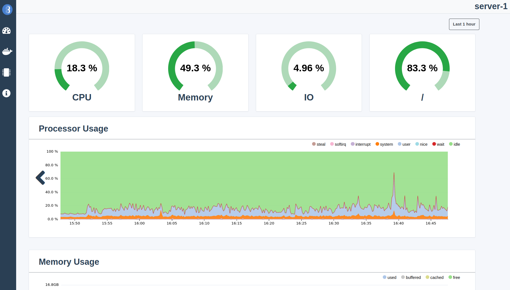

<p align="center">
   
</p>

[](https://goreportcard.com/report/github.com/bleemeo/glouton)
[](https://github.com/bleemeo/glouton/blob/master/LICENSE)

[](https://hub.docker.com/r/bleemeo/glouton/tags)

**Glouton** is a monitoring agent that makes observing your infrasture easy. Glouton retrieves metrics from **node exporter** and multiple **telegraf inputs** and expose them through a **Prometheus endpoint** and a **dashboard**. It also automatically discovers your [services](#automatically-discovered-services) to retrieve relevant metrics.

TODO: Introduce Bleemeo?



## Features

- [**Automatic discovery and configuration of services**](#automatically-discovered-services) to generate checks and metrics
- Can be used as the main **[Prometheus endpoint](#metrics-endpoint)** for another scrapper
- Support **[Nagios checks](https://docs.bleemeo.com/metrics-sources/custom/#reference-for-custom-check), [NRPE](https://docs.bleemeo.com/agent/configuration/#nrpeaddress) and [StatsD](https://docs.bleemeo.com/metrics-sources/statsd)** metrics ingester
- **Kubernetes native support** creating metrics and checks for pods
- Monitor your printers and network devices with [**SNMP**](https://docs.bleemeo.com/agent/snmp)
- **[JMX support](https://docs.bleemeo.com/metrics-sources/java)** to monitor your Java applications.

### Automatically discovered services

Glouton automatically detects and generates metrics for your services. Supported services include **Apache**, **Cassandra**, **Redis**, **Elasticsearch**, **Nginx**, **PostgreSQL**, and many others. The full list of services and generated metrics can be found [here](https://docs.bleemeo.com/metrics-sources/services-metrics).

### Metrics endpoint

A metrics endpoint is available on port http://localhost:8015/metrics by default (this can be connfigured [here](https://docs.bleemeo.com/agent/configuration#weblisteneraddress)). This is endpoint can be scrapped by Prometheus for example to retrieve the metrics and show them on graphs in Grafana.

A docker compose file is available to quickly setup a full monitoring stack. It includes Grafana, Glouton and a Prometheus configured to scrap Glouton's metrics endpoint.
```sh
cd examples/prometheus
docker-compose up
```

Then go to the Grafana dashboard at http://localhost:3000, log with the user is "admin" and the password "password".

## Install

Glouton can be installed with Docker, Kubernetes, on Windows or as a native Linux package.

### Docker

A docker image is provided to install Glouton easily.

```sh
export GLOUTON_BLEEMEO_ENABLE=false

docker run -d --name="bleemeo-agent" \
    -v /var/lib/glouton:/var/lib/glouton -v /var/run/docker.sock:/var/run/docker.sock -v /:/hostroot:ro \
    -e  GLOUTON_BLEEMEO_ENABLE='false' --pid=host --net=host \
    --cap-add SYS_PTRACE --cap-add SYS_ADMIN bleemeo/bleemeo-agent
```

### Other platforms

If you are not a Bleemeo user, disable the Bleemeo connector in `/etc/glouton/conf.d/30-install.conf`:
```
bleemeo:
   enable: false
```

To install Glouton as a native package on Linux, or to install it on Windows or Kubernetes, check out the [documentation](https://docs.bleemeo.com/agent/installation). Note that this documentation is made for users of the Bleemeo Cloud solution, but it should also work without a Bleemeo account if you skip adding the credentials to the config.

## Configuration

The full configuration file with all available options is available [here](https://docs.bleemeo.com/agent/configuration).

## Contributing

See [CONTRIBUTING.md](CONTRIBUTING.md).
