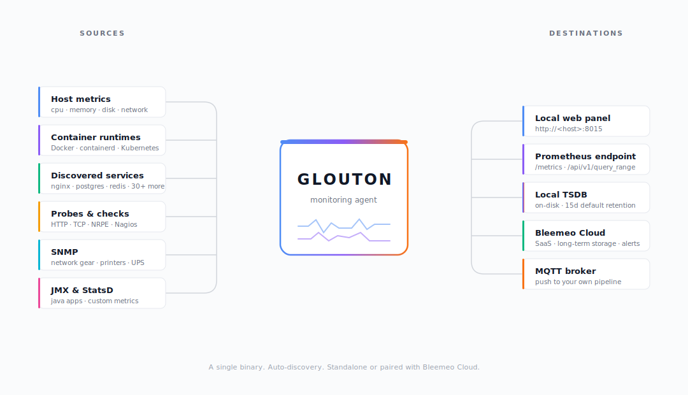
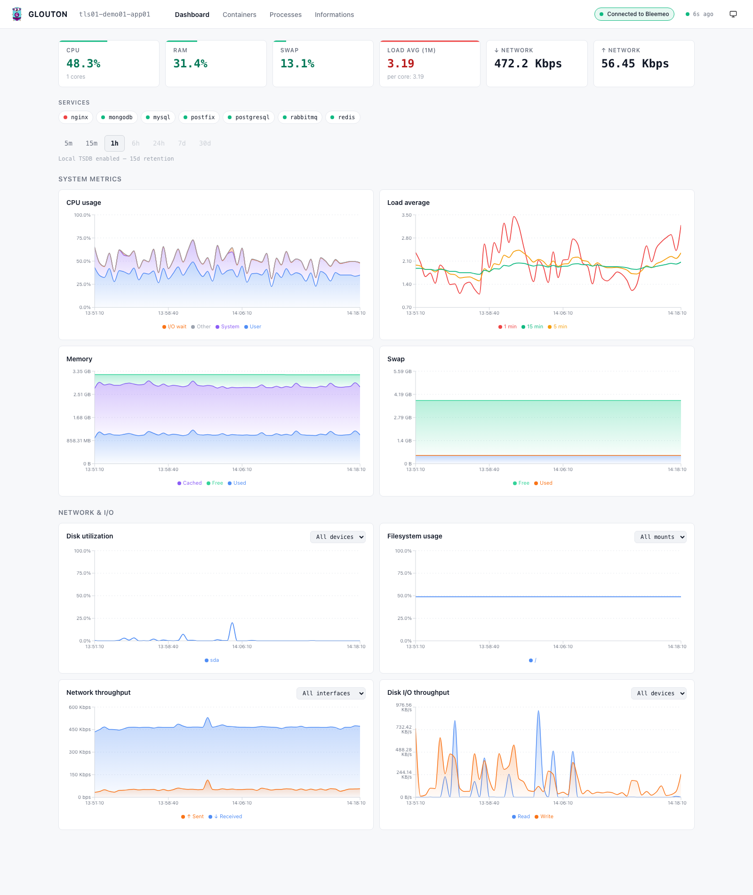
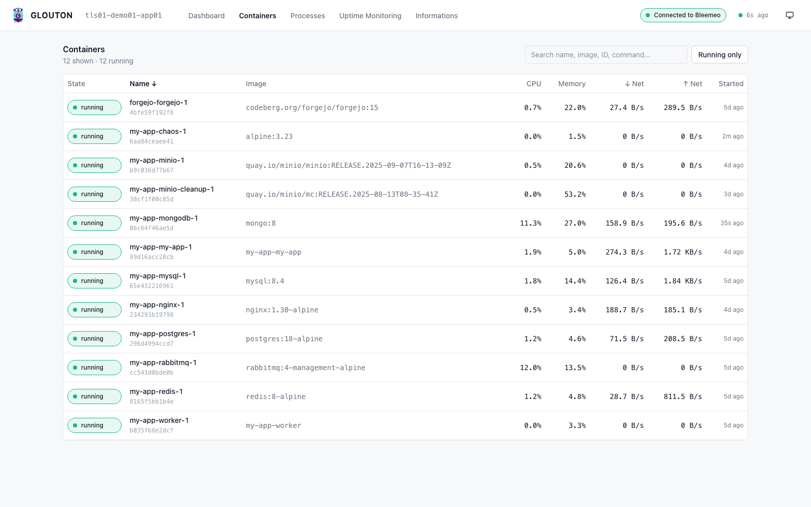
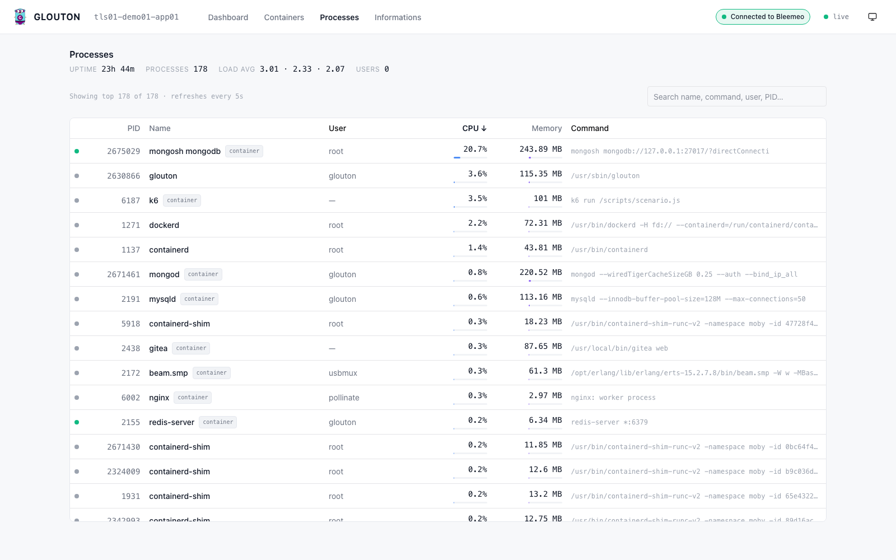
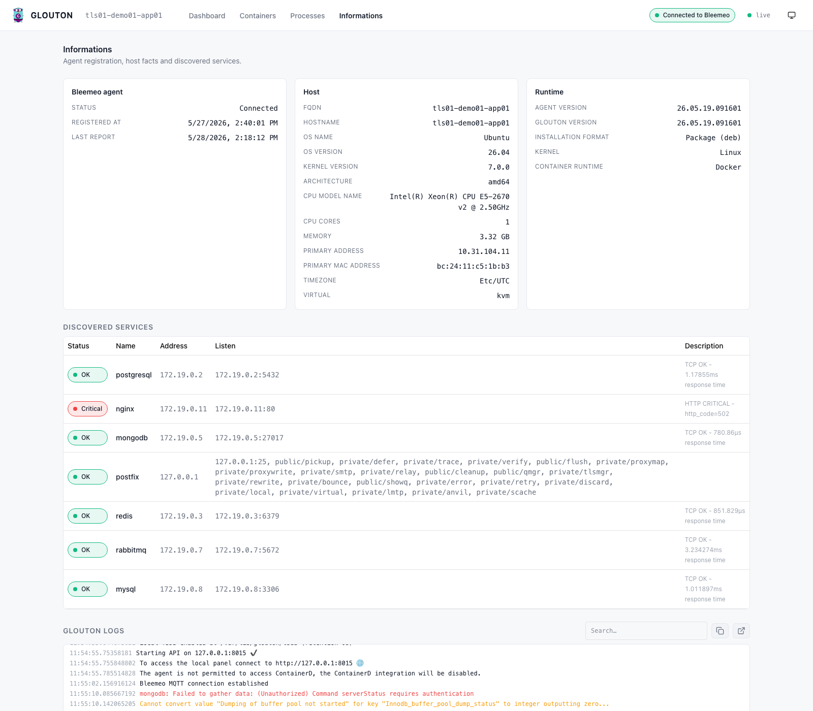

<p align="center">
  
</p>

<p align="center">
  <strong>A single-binary monitoring agent that just works.</strong><br>
  Auto-discovery, an embedded TSDB, and a status-first local panel — out of the box.
</p>

<p align="center">
  <em>Powers the <a href="https://bleemeo.com">Bleemeo Cloud</a> agent fleet; battle-tested on Linux servers, Docker, and Kubernetes.</em>
</p>

<p align="center">
  <a href="https://goreportcard.com/report/github.com/bleemeo/glouton"></a>
  <a href="https://github.com/bleemeo/glouton/blob/master/LICENSE"></a>
  
  <a href="https://hub.docker.com/r/bleemeo/glouton/tags"></a>
  <a href="https://hub.docker.com/r/bleemeo/glouton"></a>
</p>

---

## What is Glouton?

Glouton is the agent we use at Bleemeo to run our SaaS monitoring product, released as
open source. It is one binary that:

- **Auto-discovers** what's running on your host or in your containers (nginx, postgres,
  redis, and 30+ apps and protocols) and generates the right metrics and checks.
- **Collects** host, container, and service metrics out of the box, with sensible defaults.
- **Stores** them locally on disk in a built-in TSDB (15-day default retention).
- **Surfaces** everything in a live web panel at <http://localhost:8015>, and re-exposes
  the same data through a Prometheus-compatible HTTP API (scrape at `/metrics`, query
  via PromQL).
- Optionally **forwards** to [Bleemeo Cloud](https://bleemeo.com) for long-term storage,
  alerts and notifications — or to any MQTT broker you control.

<p align="center">
  
</p>

## Screenshots

The screenshots below come straight off a running Glouton; they're refreshed with
`./scripts/take-screenshots.sh` against any reachable instance.

**Dashboard** — KPI cards, discovered services row, system and I/O charts, range-aware
history.

<p align="center">
  <a href="assets/screenshots/dashboard.png"></a>
</p>

<table>
  <tr>
    <td width="33%"><strong>Containers</strong> — sortable, status-coded, click a row for the full record.</td>
    <td width="33%"><strong>Processes</strong> — top consumers, live, click for the full record.</td>
    <td width="33%"><strong>Informations</strong> — facts, services, embedded logs, Prometheus URL and diagnostic exports.</td>
  </tr>
  <tr>
    <td><a href="assets/screenshots/containers.png"></a></td>
    <td><a href="assets/screenshots/processes.png"></a></td>
    <td><a href="assets/screenshots/informations.png"></a></td>
  </tr>
</table>

## Quick start

The fastest way to see Glouton in action — no account, no signup:

```sh
docker run -d --name=glouton \
  -v /var/lib/glouton:/var/lib/glouton \
  -v /var/run/docker.sock:/var/run/docker.sock \
  -v /:/hostroot:ro \
  -e GLOUTON_BLEEMEO_ENABLE=false \
  --pid=host --net=host \
  --cap-add SYS_PTRACE --cap-add SYS_ADMIN \
  bleemeo/bleemeo-agent
```

Then open <http://localhost:8015>. With Bleemeo disabled the on-disk TSDB starts
automatically so the dashboard's longer time ranges (24 h, 7 d, 30 d) work out of the
box.

<details>
<summary>What those Docker flags do</summary>

| Flag | Why |
| --- | --- |
| `-v /var/lib/glouton:/var/lib/glouton` | Persist the state file, TSDB and registration data across container restarts. |
| `-v /var/run/docker.sock:/var/run/docker.sock` | Discover and read stats for the containers running on the host. |
| `-v /:/hostroot:ro` | Read-only access to the host filesystem (mounts, disks, kernel cmdline, `/proc/<pid>` of host processes). |
| `--pid=host` | See host processes for the process explorer and per-service discovery. |
| `--net=host` | Read network interface metrics that match what the host sees, not the container's namespace. |
| `--cap-add SYS_PTRACE` | Inspect process working sets and open file descriptors. |
| `--cap-add SYS_ADMIN` | Read namespaced filesystem and cgroup information. |

For a hardened setup (no host PID/net sharing, narrower bind mounts) follow the
[installation documentation](https://go.bleemeo.com/l/agent-installation).
</details>

## Highlights

> **Footprint:** ~100 MB RAM and 3-5 % of a single core on a typical host
> (~700 active metric series, polled every 10 s). The TSDB head accounts for
> roughly half of the resident memory and stays bounded by metric cardinality,
> not by retention — keeping more history on disk does not cost RAM.

### Collect
- **Auto-discovery** of running services with curated metric sets — see the
  [full list](https://go.bleemeo.com/l/services-metrics).
- **Container runtimes**: Docker (incl. Docker Desktop on macOS, auto-detected),
  containerd, Kubernetes.
- **Application metrics**: scrape any
  [Prometheus](https://go.bleemeo.com/l/agent-configuration) endpoint
  (`metric.prometheus.targets`, filterable per target),
  [JMX](https://go.bleemeo.com/l/java-monitoring) for Java apps,
  [StatsD](https://go.bleemeo.com/l/doc-statsd) for custom counters and gauges.
- **Log-derived metrics**: parse journald, syslog, auditd or container logs through an
  OpenTelemetry pipeline and emit counters (errors per second, slow requests, custom
  patterns). The lines themselves are not stored or forwarded.
- **Probes & checks**: HTTP/HTTPS, TCP, custom Nagios-style scripts,
  [NRPE](https://go.bleemeo.com/l/agent-configuration-nagios-nrpe).
- **Network & hardware**:
  [SNMP](https://go.bleemeo.com/l/network-monitoring-installation), SMART, IPMI,
  NVIDIA.
- **Kubernetes-native**: per-pod metrics and checks driven by the cluster's own labels.

### Store
- **Built-in TSDB** (Prometheus' on-disk engine, embedded). 15-day default retention,
  configurable, no extra process. Auto-enabled when running without Bleemeo so the
  panel's history works straight after `docker run`.
- **Prometheus endpoint** at `/metrics` for any external scraper.
- **PromQL-compatible HTTP API** at `/api/v1/query` and `/api/v1/query_range` — same
  shape as a Prometheus server, so Grafana and friends connect with no glue.

### Surface
- **Local panel** at `localhost:8015` with KPI cards, discovered services row,
  status-coded charts (system metrics, network & I/O), filesystem and disk
  utilisation filterable per device or mount, drag-to-zoom on every chart,
  theme-aware (system, light, dark).
- **Per-container detail page** with its own historical charts.
- **Live agent logs** embedded in the panel, with search and severity colouring
  (inferred from message keywords).
- **Diagnostic bundle** downloadable from the UI for support cases.

### Forward
- **[Bleemeo Cloud](https://bleemeo.com)** — SaaS with long-term retention, alerts,
  notifications, account-wide dashboards. Free trial.
- **MQTT broker** of your choice — pair with
  [SquirrelDB Ingestor](https://github.com/bleemeo/squirreldb-ingestor) for a
  self-hosted Prometheus alternative, or write your own consumer (messages are JSON,
  zlib-compressed).

## What Glouton is not

Setting expectations honestly:

- **Not a log shipper.** Glouton can *derive metrics* from application logs (see the
  "Log-derived metrics" bullet above), and it surfaces its own runtime logs in the
  panel for debugging, but it does not store, index, or forward log lines themselves.
  Use [Vector](https://vector.dev/), [Fluent Bit](https://fluentbit.io/), or the
  OpenTelemetry collector if that's what you need.
- **Not a tracing / APM agent.** No spans, no transaction tracking. Pair with an
  OpenTelemetry SDK on your application side if you need that.
- **Not a Prometheus replacement on its own.** Glouton serves a Prometheus-compatible
  endpoint and ships an embedded TSDB suitable for a single host, but for a
  cluster-wide setup you still want a real Prometheus, a Mimir/Thanos backend, or
  [Bleemeo Cloud](https://bleemeo.com).

## Install

- **Docker** — see [Quick start](#quick-start). A Docker Compose layout with `jmxtrans`
  alongside Glouton lives in [`docker-compose.yml`](docker-compose.yml).
- **Native Linux package** — officially built `.deb` (Debian, Ubuntu) and `.rpm`
  (RHEL, CentOS, Fedora) packages. Follow the
  [installation documentation](https://go.bleemeo.com/l/agent-installation); it
  targets Bleemeo users but works just as well without an account once you set
  `bleemeo.enable: false`.
- **Windows installer** — MSI built from
  [`packaging/windows/`](packaging/windows), see the same installation
  documentation.
- **Kubernetes** — `kubectl apply -f k8s.yaml` from the repo root for a default
  DaemonSet + RBAC manifest, or follow the
  [installation documentation](https://go.bleemeo.com/l/agent-installation) for the
  Helm chart and per-cluster options.
- **macOS** — no packaged installer yet; use the published Docker image for the runtime
  case, or build from source with `go run .` from a clone (see
  [CONTRIBUTING.md](CONTRIBUTING.md)) for development. Docker Desktop and Colima sockets
  are auto-detected, so your containers show up without any extra config.

## Updating

Release notes are on the [GitHub Releases](https://github.com/bleemeo/glouton/releases)
page.

- **Linux package** — `glouton-auto-upgrade.timer` is enabled by default and pulls
  fresh packages from the configured repository. To disable, mask the timer:
  `systemctl disable --now glouton-auto-upgrade.timer`.
- **Docker** — `docker pull bleemeo/bleemeo-agent && docker restart glouton`. Tag a
  specific version (e.g. `bleemeo/bleemeo-agent:25.10.07.142359`) if you prefer to
  pin and bump manually.
- **Kubernetes** — bump the image in your `k8s.yaml` / Helm values and re-apply.

## Configuration

Out-of-the-box defaults work for most cases. To opt out of the Bleemeo connector and
run fully standalone, this is enough:

```yaml
bleemeo:
  enable: false
```

Drop that into `/etc/glouton/conf.d/30-install.conf` on a packaged install, or pass it
as `-e GLOUTON_BLEEMEO_ENABLE=false` with the Docker image.

A few knobs people often touch:

```yaml
agent:
  local_store:
    # enable: null      # tri-state: null = auto (on iff bleemeo.enable is false)
    retention: 15d      # how far back the on-disk TSDB keeps points

thresholds:             # per-metric thresholds, drive the service_status / agent_status
  cpu_used:
    high_warning: 80
    high_critical: 95
  mem_used_perc:
    high_warning: 80
    high_critical: 95

metric:                 # scrape arbitrary Prometheus endpoints
  prometheus:
    targets:
      - name: my-app
        url: http://my-app.internal:8080/metrics
        # allow_metrics: [http_requests_total, http_request_duration_seconds]
        # deny_metrics:  [go_gc_*]
```

The full reference, with every available key, lives in the
[agent configuration documentation](https://go.bleemeo.com/l/agent-configuration).

## Telemetry

By default Glouton posts a single anonymous payload to
`https://telemetry.bleemeo.com/v1/telemetry/` once per agent start. It contains:

- A random per-install ID (not your hostname, not the Bleemeo agent UUID).
- Whether the Bleemeo connector is active (`true` / `false`).
- Glouton version, installation format (package / Docker / manual).
- OS name and version, kernel version, system architecture.
- CPU cores and model, total memory.
- Timezone (used as a coarse country signal).

**No metric values, no service names, no IP addresses or hostnames are sent.** It
helps us understand the deployment surface we're shipping for. To opt out, add this
to the config (or set `GLOUTON_AGENT_TELEMETRY_ENABLE=false`):

```yaml
agent:
  telemetry:
    enable: false
```

## Examples

The [`examples/`](examples) folder contains ready-to-run docker-compose stacks that
plug Glouton into a wider pipeline.

### Local Grafana + Prometheus

```sh
(cd examples/prometheus && docker-compose up -d)   # Linux
(cd examples/prometheus_mac && docker-compose up -d)  # macOS
```

Then open <http://localhost:3000/d/83ceCuenk/> (admin / password).

### Push to MQTT + SquirrelDB

```sh
(cd examples/mqtt && docker-compose up -d)
```

Same Grafana URL. The example uses NATS as the broker and SquirrelDB Ingestor to
write to [SquirrelDB](https://github.com/bleemeo/squirreldb). See the
[SquirrelDB Ingestor README](https://github.com/bleemeo/squirreldb-ingestor) for
authentication and HA notes.

Glouton's MQTT messages are published on `v1/agent/<fqdn>/data` (with `.` in the FQDN
replaced by `,` because NATS doesn't allow dots in topics) and look like:

```json
[
  {
    "labels_text": "__name__=cpu_used",
    "time_ms": 1665479613948,
    "value": 46.8
  }
]
```

## Documentation

- [Agent installation](https://go.bleemeo.com/l/agent-installation)
- [Configuration reference](https://go.bleemeo.com/l/agent-configuration)
- [Discovered services & metrics](https://go.bleemeo.com/l/services-metrics)
- [Custom service checks](https://go.bleemeo.com/l/custom-service-check)
- [Network / SNMP monitoring](https://go.bleemeo.com/l/network-monitoring-installation)
- [Java / JMX monitoring](https://go.bleemeo.com/l/java-monitoring)
- [Nagios / NRPE integration](https://go.bleemeo.com/l/agent-configuration-nagios-nrpe)
- [StatsD ingestion](https://go.bleemeo.com/l/doc-statsd)

## Contributing

See [CONTRIBUTING.md](CONTRIBUTING.md) for the build / test / dev loop, plus tips for
hacking on the web UI and the macOS workflow. Bug reports and feature requests are
welcome in [GitHub Issues](https://github.com/bleemeo/glouton/issues).

## Acknowledgements

Glouton stands on the shoulders of several open-source projects we ship as libraries:

- [Prometheus](https://prometheus.io/) (TSDB engine, PromQL, model)
- [node_exporter](https://github.com/prometheus/node_exporter) (host metrics on
  Linux/Darwin/FreeBSD/Windows)
- [Telegraf](https://github.com/influxdata/telegraf) (per-service inputs)
- [Blackbox exporter](https://github.com/prometheus/blackbox_exporter) (HTTP/TCP/DNS
  probes, certificate expiry)
- [OpenTelemetry collector](https://opentelemetry.io/) (log processing pipeline)
- [gopsutil](https://github.com/shirou/gopsutil) (cross-platform process and host
  inspection)

## License

Glouton is released under the Apache License 2.0 — see [LICENSE](LICENSE) for the full
text.
